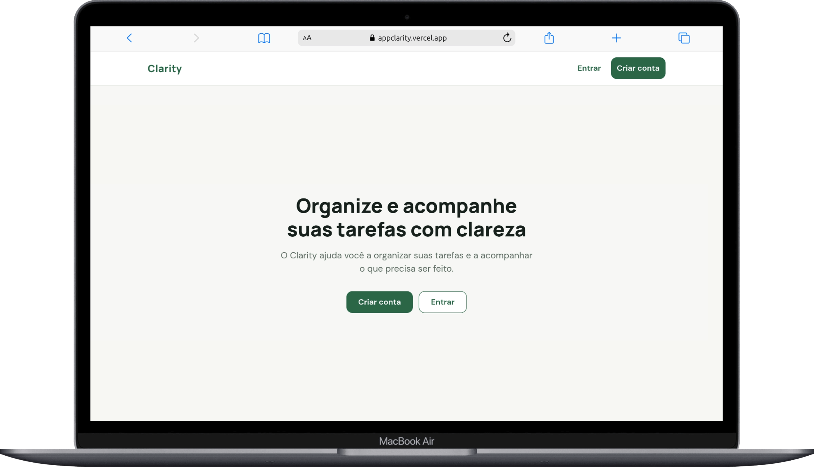
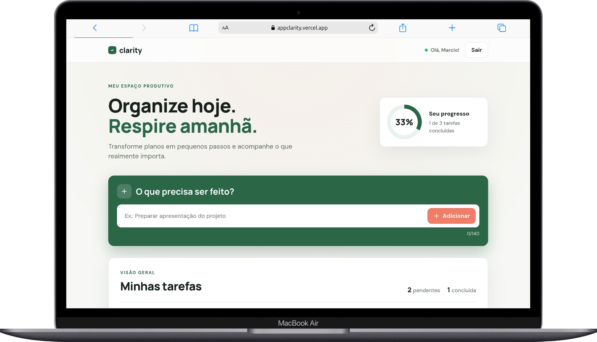
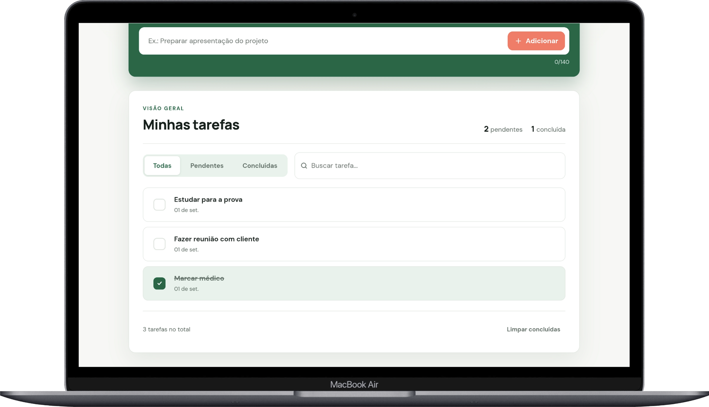
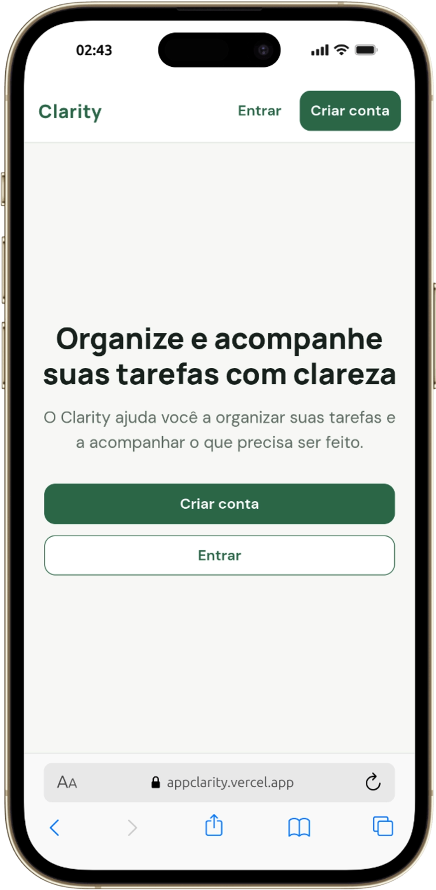
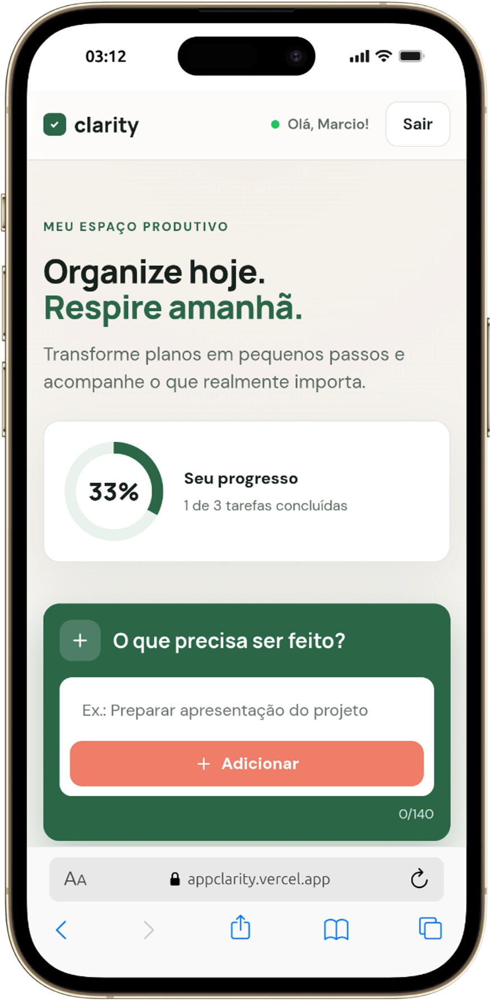
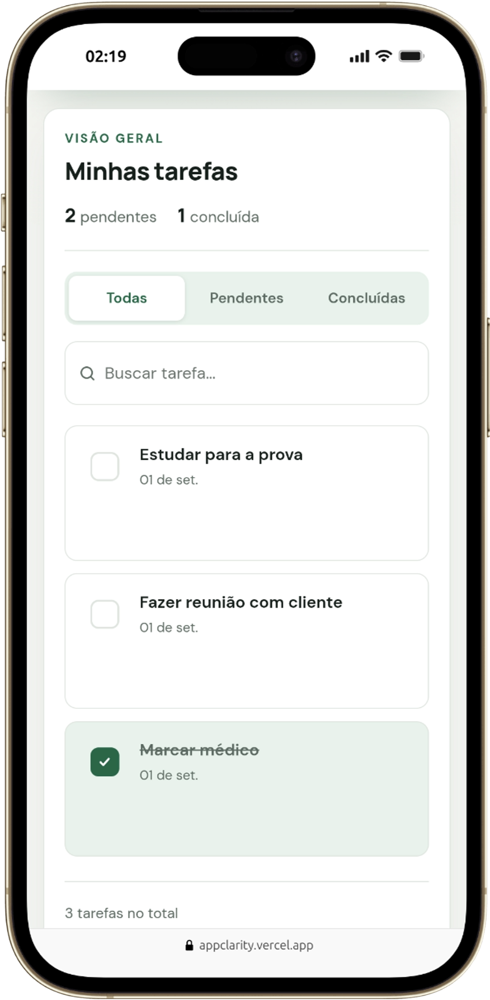
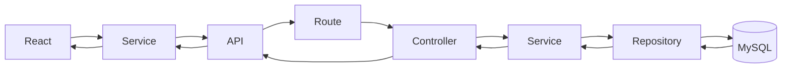
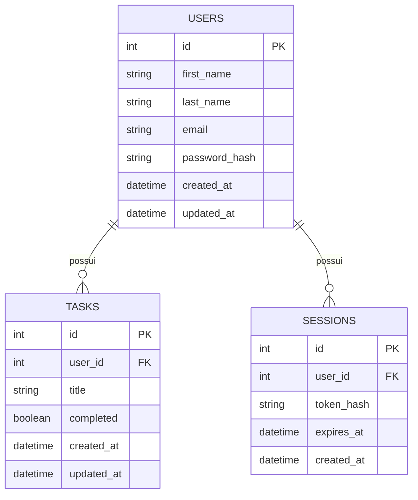
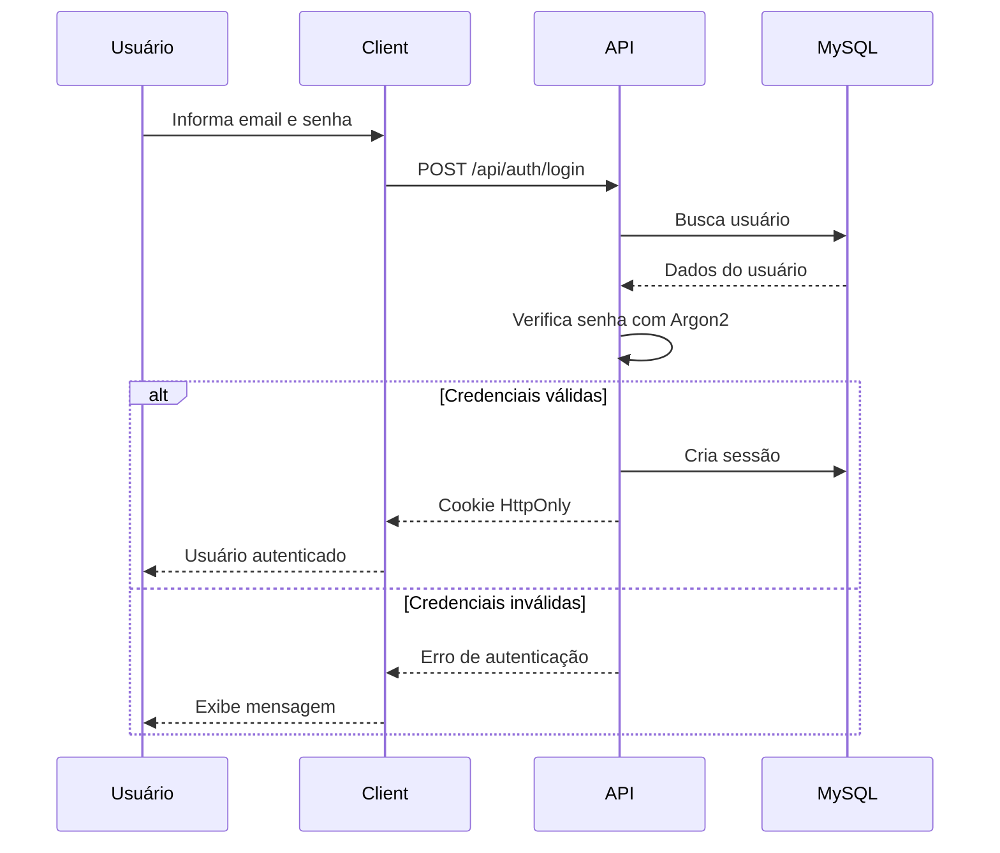
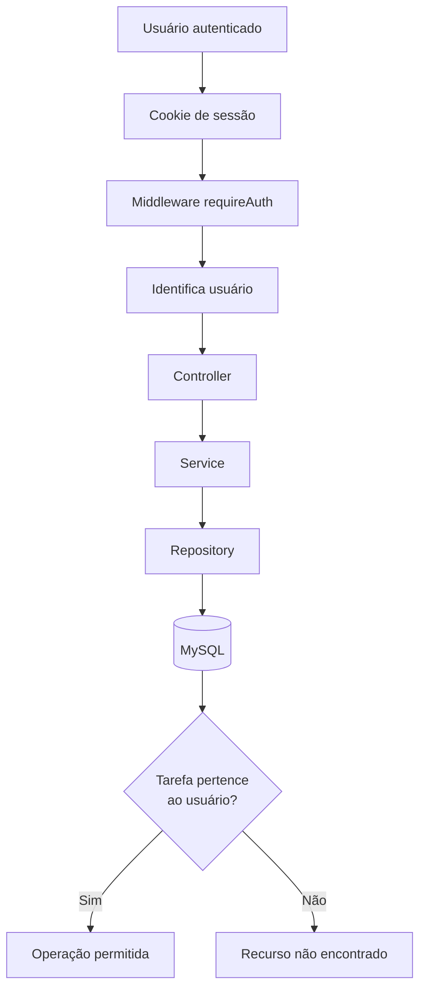

# ✨ Clarity

> Organize hoje. Respire amanhã.

Uma aplicação **full stack de gerenciamento de tarefas**, desenvolvida com foco em arquitetura, autenticação, segurança, responsividade, acessibilidade e testes automatizados.

---

## 🚀 Demonstração

🔗 **Acesse a aplicação:** [https://appclarity.vercel.app/](https://appclarity.vercel.app/)

---

## 📸 Preview

Clique nas imagens para ampliar.

### Landing page

<p align="center">
    <a href="docs/images/preview/landing-desktop.png">
        
    </a>
</p>

### Gerenciamento de tarefas

<p align="center">
    <a href="docs/images/preview/tasks-desktop-top.png">
        
    </a>
</p>

<p align="center">
    <a href="docs/images/preview/tasks-desktop-bottom.png">
        
    </a>
</p>

### Responsividade

<p align="center">
    <a href="docs/images/preview/landing-mobile-bottom.png">
        
    </a>

    <a href="docs/images/preview/tasks-mobile-top.png">
        
    </a>

    <a href="docs/images/preview/tasks-mobile-bottom.png">
        
    </a>
</p>

---

# 📋 Índice

- [Demonstração](#-demonstração)
- [Preview](#-preview)
- [Sobre o projeto](#-sobre-o-projeto)
- [Funcionalidades](#-funcionalidades)
- [Tecnologias](#-tecnologias)
- [Arquitetura](#-arquitetura)
- [Estrutura do projeto](#-estrutura-do-projeto)
- [Modelo de dados](#-modelo-de-dados)
- [Autenticação](#-autenticação)
- [Isolamento entre usuários](#-isolamento-entre-usuários)
- [Rotas da aplicação](#-rotas-da-aplicação)
- [API](#-api)
- [Banco de dados e migrations](#-banco-de-dados-e-migrations)
- [Testes](#-testes)
- [Responsividade](#-responsividade)
- [Acessibilidade](#-acessibilidade)
- [Segurança](#-segurança)
- [Decisões técnicas](#-decisões-técnicas)
- [Instalação](#-instalação)
- [Build e execução em produção](#-build-e-execução-em-produção)
- [Scripts disponíveis](#-scripts-disponíveis)
- [Próximos passos](#-próximos-passos)
- [Status](#-status)

---

# 💡 Sobre o projeto

O **Clarity** é uma aplicação de gerenciamento de tarefas desenvolvida como projeto de estudo e portfólio.

Mais do que construir apenas uma interface de To-Do List, o objetivo do projeto é praticar a construção de uma aplicação completa, envolvendo:

- desenvolvimento front-end;
- desenvolvimento de API;
- autenticação;
- persistência em banco de dados relacional;
- arquitetura em camadas;
- gerenciamento de sessão;
- isolamento de dados entre usuários;
- validação de dados;
- tratamento de erros;
- segurança;
- responsividade;
- acessibilidade;
- testes automatizados;
- testes end-to-end.

A aplicação foi construída utilizando uma arquitetura full stack separada entre **client**, **server** e **database**.

---

# ✨ Funcionalidades

## 👤 Autenticação

- Cadastro de novos usuários
- Login
- Logout
- Recuperação da sessão atual
- Restauração da sessão ao recarregar a página
- Rotas públicas
- Rotas protegidas
- Redirecionamento de usuários não autenticados
- Expiração e invalidação de sessão

---

## ✅ Gerenciamento de tarefas

- Criar tarefas
- Listar tarefas
- Editar o título de uma tarefa
- Marcar tarefas como concluídas
- Reabrir tarefas concluídas
- Excluir tarefas individualmente
- Excluir todas as tarefas concluídas
- Filtrar tarefas por status:
    - Todas
    - Pendentes
    - Concluídas
- Buscar tarefas por título
- Visualizar resumo das tarefas
- Visualizar progresso das tarefas

---

## 🧑‍💻 Experiência do usuário

- Estados de carregamento
- Skeleton loading
- Estados vazios
- Estados de erro
- Mensagens de validação
- Confirmação antes de ações destrutivas
- Interface responsiva
- Abordagem Mobile First
- Navegação por teclado
- Gerenciamento de foco
- Skip links
- Suporte a preferências de redução de movimento

---

# 🛠 Tecnologias

## Front-end

| Tecnologia           | Utilização                          |
| -------------------- | ----------------------------------- |
| **React**            | Construção da interface             |
| **TypeScript**       | Tipagem estática                    |
| **Vite**             | Ambiente de desenvolvimento e build |
| **React Router DOM** | Roteamento da aplicação             |
| **Redux Toolkit**    | Estado global de autenticação       |
| **React Redux**      | Integração do Redux com React       |
| **CSS Modules**      | Estilização componentizada          |
| **Vitest**           | Testes automatizados                |
| **Testing Library**  | Testes de componentes               |
| **Playwright**       | Testes end-to-end                   |

---

## Back-end

| Tecnologia     | Utilização                |
| -------------- | ------------------------- |
| **Node.js**    | Ambiente de execução      |
| **Express**    | API HTTP                  |
| **TypeScript** | Tipagem estática          |
| **MySQL**      | Banco de dados relacional |
| **mysql2**     | Comunicação com o MySQL   |

---

## Autenticação e segurança

| Tecnologia             | Utilização              |
| ---------------------- | ----------------------- |
| **Argon2id**           | Hash de senhas          |
| **Cookies HttpOnly**   | Gerenciamento de sessão |
| **cookie-parser**      | Leitura de cookies      |
| **Helmet**             | Headers de segurança    |
| **express-rate-limit** | Rate limiting           |
| **dotenv**             | Variáveis de ambiente   |

---

# 🏗 Arquitetura

O Clarity utiliza uma arquitetura full stack separada em três partes principais:

```text
┌─────────────────────────────────────────────┐
│                   CLIENT                    │
│                                             │
│   React + TypeScript + Redux + CSS Modules  │
└──────────────────────┬──────────────────────┘
                       │
                       │ HTTP
                       ▼
┌─────────────────────────────────────────────┐
│                   SERVER                    │
│                                             │
│        Node.js + Express + TypeScript       │
│                                             │
│ Route → Controller → Service → Repository   │
└──────────────────────┬──────────────────────┘
                       │
                       │ SQL
                       ▼
┌─────────────────────────────────────────────┐
│                  DATABASE                   │
│                                             │
│                    MySQL                    │
└─────────────────────────────────────────────┘
```

Também podemos representar o fluxo de uma requisição:



No back-end, o código segue a direção de dependência **route → controller → service → repository → banco**:

- **Routes** — definem os endpoints e conectam middlewares e controllers (sem regra de negócio ou SQL);
- **Controllers** — tratam de preocupações HTTP (dados da requisição, resposta e status);
- **Services** — contêm as regras de negócio e não dependem de `Request`/`Response` do Express;
- **Repositories** — concentram todo o acesso ao banco e o SQL (sempre parametrizado).

Essa separação evita que regras de negócio fiquem diretamente nos controllers ou que detalhes de SQL se espalhem pela aplicação.

---

# 📁 Estrutura do projeto

```text
clarity/
│
├── client/                         # Front-end (React + Vite)
│   │
│   ├── e2e/                        # Testes end-to-end (Playwright)
│   │   ├── helpers/
│   │   ├── critical-flow.spec.ts
│   │   ├── session-expiry.spec.ts
│   │   └── user-isolation.spec.ts
│   │
│   ├── src/
│   │   ├── app/                    # Store Redux e hooks
│   │   │   ├── hooks.ts
│   │   │   └── store.ts
│   │   │
│   │   ├── components/             # Componentes reutilizáveis
│   │   ├── config/                 # Configuração (URL da API)
│   │   ├── features/               # Recursos por domínio (ex.: auth)
│   │   ├── hooks/                  # Hooks customizados (ex.: useTasks)
│   │   ├── layouts/                # PublicLayout e AppLayout
│   │   ├── pages/                  # Páginas da aplicação
│   │   ├── services/               # Comunicação HTTP com a API
│   │   ├── types/                  # Tipos de domínio
│   │   └── utils/                  # Funções utilitárias
│   │
│   ├── .env.example                # Variáveis públicas do cliente (VITE_*)
│   └── package.json
│
├── server/                         # Back-end (Node + Express)
│   │
│   ├── src/
│   │   ├── config/                 # Variáveis de ambiente
│   │   ├── database/               # Pool de conexões MySQL
│   │   ├── errors/                 # AppError e tratamento de erros
│   │   ├── middlewares/            # requireAuth, rate limiters, errorHandler
│   │   ├── modules/                # users, auth e tasks (route → controller → service → repository)
│   │   │   ├── auth/
│   │   │   ├── tasks/
│   │   │   └── users/
│   │   ├── types/                  # Tipos globais
│   │   ├── app.ts
│   │   └── server.ts
│   │
│   ├── tests/
│   │   └── integration/            # Testes de integração da API
│   │
│   └── package.json
│
├── database/
│   └── migrations/                 # Migrations SQL
│
├── docs/                           # Documentação complementar
│
├── .env.example
├── AGENTS.md
└── README.md
```

A organização busca manter responsabilidades separadas e facilitar a manutenção e os testes.

---

# 🗄 Modelo de dados

O banco possui três tabelas:

| Tabela       | Descrição                                        |
| ------------ | ------------------------------------------------ |
| **users**    | Contas de usuário (nome, e-mail e hash de senha) |
| **tasks**    | Tarefas, cada uma vinculada a um usuário         |
| **sessions** | Sessões ativas (hash do token por usuário)       |



A relação principal é:

- um usuário pode possuir várias tarefas;
- cada tarefa pertence a exatamente um usuário (`tasks.user_id` com `NOT NULL`);
- exclusão de usuário propaga a remoção de suas tarefas e sessões (`ON DELETE CASCADE`);
- o detalhamento do modelo está registrado em [`docs/auth-model.md`](docs/auth-model.md).

---

# 🔐 Autenticação

- autenticação por **e-mail + senha**;
- a senha nunca é armazenada em texto puro — apenas o hash gerado com **Argon2id**;
- sessão baseada em **cookie HttpOnly** (`sid`) combinada com **sessão server-side**;
- apenas o **hash SHA-256** do token é persistido na tabela `sessions`;
- duração da sessão: **24 horas** (`expires_at` no banco e `Max-Age` do cookie alinhados a uma única fonte de verdade);
- cookie configurado com `HttpOnly` e `Path=/`; em produção usa `SameSite=None` e `Secure` (necessário para o fluxo cross-site entre a Vercel e o Render), enquanto em desenvolvimento/teste usa `SameSite=Lax` sem `Secure`;
- os endpoints de sessão estão documentados na seção [API](#-api).

Fluxo de login:



Após a autenticação:

```text
Browser
    │
    │ Cookie HttpOnly
    ▼
API
    │
    ▼
Middleware de autenticação
    │
    ├── Sessão válida
    │       ↓
    │    Usuário autenticado
    │       ↓
    │    Controller
    │
    └── Sessão inválida
            ↓
          401
```

A documentação completa do modelo está em [`docs/auth-model.md`](docs/auth-model.md).

---

# 🔒 Isolamento entre usuários

O `userId` nunca é tratado como uma informação confiável enviada pelo cliente. Em vez disso, o servidor identifica o usuário através da sessão e usa esse contexto em todas as operações do domínio:

O fluxo pode ser representado assim:



---

# 🧭 Rotas da aplicação

## Front-end

| Rota        | Tipo      | Descrição                        |
| ----------- | --------- | -------------------------------- |
| `/`         | Pública   | Landing page                     |
| `/login`    | Pública   | Login                            |
| `/register` | Pública   | Cadastro                         |
| `/app`      | Protegida | Área de gerenciamento de tarefas |
| `*`         | Pública   | NotFoundPage                     |

A aplicação diferencia rotas públicas e protegidas.

Usuários não autenticados não podem acessar diretamente a área de tarefas.

---

# 🔌 API

As rotas da API usam o prefixo `/api`, com exceção do health check (`/health`). Respostas de sucesso seguem o formato `{ "data": ... }`; erros seguem `{ "error": "mensagem" }`.

## Health check

| Método | Endpoint  | Descrição                                                  | Autenticação | Corpo | Sucesso      |
| ------ | --------- | ---------------------------------------------------------- | ------------ | ----- | ------------ |
| `GET`  | `/health` | Verifica a disponibilidade da API e da conexão com o banco | Não          | -     | `200`/ `503` |

---

## Autenticação

| Método | Endpoint           | Descrição                     | Autenticação     | Corpo                                                            | Sucesso |
| ------ | ------------------ | ----------------------------- | ---------------- | ---------------------------------------------------------------- | ------- |
| `POST` | `/api/users`       | Cria um novo usuário          | Não (rate limit) | `{ firstName, lastName, email, password, passwordConfirmation }` | `201`   |
| `POST` | `/api/auth/login`  | Autentica o usuário           | Não (rate limit) | `{ email, password }`                                            | `200`   |
| `GET`  | `/api/auth/me`     | Retorna o usuário autenticado | Cookie           | -                                                                | `200`   |
| `POST` | `/api/auth/logout` | Encerra a sessão              | Cookie           | -                                                                | `204`   |

---

## Tarefas

Todas as rotas abaixo exigem autenticação.

| Método   | Endpoint               | Descrição                          | Autenticação | Corpo                    | Sucesso |
| -------- | ---------------------- | ---------------------------------- | ------------ | ------------------------ | ------- |
| `GET`    | `/api/tasks`           | Lista as tarefas do usuário        | Sim          | -                        | `200`   |
| `POST`   | `/api/tasks`           | Cria uma tarefa                    | Sim          | `{ title }`              | `201`   |
| `PATCH`  | `/api/tasks/:id`       | Altera o status de conclusão       | Sim          | `{ completed: boolean }` | `200`   |
| `PATCH`  | `/api/tasks/:id/title` | Edita o título                     | Sim          | `{ title }`              | `200`   |
| `DELETE` | `/api/tasks/:id`       | Remove uma tarefa                  | Sim          | -                        | `204`   |
| `DELETE` | `/api/tasks/completed` | Remove todas as tarefas concluídas | Sim          | -                        | `204`   |

---

# 🗃 Banco de dados e migrations

O projeto utiliza:

- MySQL;
- SQL puro;
- `mysql2`;
- migrations versionadas.

As migrations são responsáveis pela evolução da estrutura do banco de dados.

---

# 🧪 Testes

O projeto utiliza diferentes níveis de testes.

```text
        /\
       /E2E\
      /------\
     /        \
    /Integração\
   /------------\
  /              \
 /   Unitários    \
/------------------\
```

---

## Testes unitários

Os testes unitários cobrem partes isoladas da aplicação.

Entre os elementos testados estão:

- validações;
- componentes;
- filtros;
- comportamentos de interface;
- regras de negócio;
- tratamento de erros.

---

## Testes de integração

Os testes de integração validam a comunicação entre partes da API.

São utilizados para verificar fluxos como:

- autenticação;
- proteção de rotas;
- operações relacionadas a tarefas;
- respostas HTTP;
- integração entre camadas.

---

## Testes end-to-end

Os testes E2E utilizam **Playwright**.

Eles simulam fluxos completos da aplicação.

Os testes E2E rodam contra um banco de dados dedicado (`clarity_e2e`), recriado automaticamente antes de cada execução.

### Fluxo crítico

```text
Cadastro
    ↓
Login
    ↓
Criar tarefa
    ↓
Editar tarefa
    ↓
Concluir tarefa
    ↓
Buscar
    ↓
Filtrar
    ↓
Logout
```

### Isolamento entre usuários

```text
Usuário A
    ↓
Cria tarefas
    ↓
Logout
    ↓
Usuário B
    ↓
Login
    ↓
Não visualiza as tarefas do Usuário A
```

### Expiração de sessão

Também existem testes para validar o comportamento da aplicação quando uma sessão deixa de ser válida.

---

# 📱 Responsividade

A interface foi desenvolvida seguindo a abordagem **Mobile First**.

O desenvolvimento começa considerando telas menores e o layout é progressivamente adaptado para:

- dispositivos móveis;
- celulares maiores;
- tablets;
- notebooks;
- desktops.

A responsividade não é tratada apenas como uma adaptação visual, mas também considera:

- áreas de toque;
- ausência de hover em dispositivos touch;
- reorganização de componentes;
- legibilidade;
- comportamento de formulários;
- navegação.

---

# ♿ Acessibilidade

O projeto considera diferentes aspectos de acessibilidade.

Entre eles:

- navegação por teclado;
- foco visível;
- gerenciamento de foco;
- labels associadas aos campos;
- atributos `aria-*`;
- mensagens de erro acessíveis;
- skip links;
- áreas clicáveis adequadas;
- suporte a `prefers-reduced-motion`;
- atenção ao contraste visual.

---

# 🛡 Segurança

Antes da etapa de deploy, foram adicionadas medidas voltadas à segurança e robustez da aplicação.

Entre elas:

- hash de senha com Argon2id;
- autenticação baseada em sessão;
- cookies HttpOnly;
- validação de dados de entrada;
- queries parametrizadas;
- middleware de autenticação;
- tratamento centralizado de erros;
- Helmet;
- rate limiting em rotas sensíveis;
- variáveis de ambiente para informações sensíveis;
- tratamento de sessão expirada.

---

# 🧠 Decisões técnicas

## SQL puro em vez de ORM

O projeto utiliza SQL diretamente através do `mysql2`.

A decisão foi tomada para permitir uma compreensão mais próxima de:

- consultas SQL;
- joins;
- chaves estrangeiras;
- migrations;
- persistência;
- relacionamento entre entidades.

Além disso, a camada de repository mantém os detalhes de acesso ao banco separados das regras de negócio.

---

## Redux Toolkit apenas para estado global necessário

O Redux Toolkit é utilizado para o estado global relacionado à autenticação.

Nem todo estado da aplicação foi colocado no Redux.

Estados específicos do domínio de tarefas permanecem próximos da funcionalidade responsável por eles.

A intenção é evitar transformar o Redux em um armazenamento global para qualquer estado da aplicação.

---

## Sessão com cookie HttpOnly

A autenticação não depende de armazenar tokens diretamente em `localStorage`.

O identificador da sessão é enviado através de um cookie HttpOnly.

Isso reduz a necessidade de expor o identificador da sessão ao JavaScript da aplicação.

---

## Arquitetura em camadas no back-end

A arquitetura em camadas, detalhada na seção [Arquitetura](#-arquitetura), permite que cada camada tenha uma responsabilidade específica.

Isso facilita:

- manutenção;
- testes;
- evolução das regras de negócio;
- substituição de detalhes de persistência;
- organização do código.

---

## Desenvolvimento incremental

O Clarity foi desenvolvido passo a passo.

A evolução do projeto priorizou:

```text
Funcionalidade pequena
        ↓
Implementação
        ↓
Testes
        ↓
Validação
        ↓
Refatoração quando necessária
        ↓
Commit coerente
```

Essa abordagem permitiu que a arquitetura evoluísse junto com a complexidade da aplicação.

---

# 💻 Instalação

## Pré-requisitos

Antes de começar, é necessário ter instalado:

- Node.js (18 ou superior, por usar ESM e `tsx`)
- npm
- MySQL

---

## 1. Clone o repositório

```bash
git clone https://github.com/juniormps/clarity.git
```

Entre no diretório:

```bash
cd clarity
```

---

## 2. Configure as variáveis de ambiente

O projeto separa as variáveis em dois grupos: as do **servidor** e as do **cliente**.

### Variáveis do servidor

Na raiz do projeto, crie o arquivo `.env` a partir do modelo:

```bash
cp .env.example .env
```

O servidor carrega o `.env` a partir da raiz do projeto. As variáveis disponíveis são:

| Variável      | Obrigatória | Padrão        | Descrição                                       |
| ------------- | ----------- | ------------- | ----------------------------------------------- |
| `PORT`        | Não         | `3000`        | Porta em que o servidor escuta                  |
| `NODE_ENV`    | Não         | `development` | Ambiente: `development`, `test` ou `production` |
| `CLIENT_ORIGIN` | Não¹       | `http://localhost:5173` | Origem do frontend autorizada no CORS. Obrigatória em produção (URL do frontend, sem barra final). |
| `DB_HOST`     | Sim         | —             | Host do MySQL                                   |
| `DB_PORT`     | Sim         | —             | Porta do MySQL                                  |
| `DB_USER`     | Sim         | —             | Usuário do MySQL                                |
| `DB_PASSWORD` | Sim         | —             | Senha do usuário do MySQL                       |
| `DB_NAME`         | Sim         | —             | Nome do banco de dados                          |
| `DB_SSL_CA_PATH`  | Não         | —             | Caminho do certificado CA para a conexão MySQL TLS |

O `NODE_ENV` define o ambiente de execução:

- `development` (padrão): execução local;
- `test`: utilizado pelos testes automatizados;
- `production`: habilita a flag `Secure` no cookie de sessão (exige HTTPS).

`CLIENT_ORIGIN` define a origem do frontend autorizada no CORS (¹ = opcional fora de produção, obrigatória em produção). Em desenvolvimento/teste, quando vazia, assume `http://localhost:5173`. Em produção deve apontar para a URL completa do frontend, **sem barra final** (ex.: `https://appclarity.vercel.app`).

As variáveis do servidor:

- são lidas em **runtime** pelo servidor;
- podem conter informações sensíveis (como credenciais de banco);
- **não** são expostas ao cliente.

> ⚠️ Nunca envie arquivos `.env` com informações sensíveis para o repositório.

`DB_SSL_CA_PATH` é opcional: quando ausente, o servidor conecta ao MySQL sem TLS (comportamento padrão do desenvolvimento local). Em produção, quando o provedor MySQL exigir validação por CA (ex.: Aiven), defina essa variável com o caminho do certificado CA disponibilizado como Secret File (ex.: `/etc/secrets/aiven-ca.pem`).

Os testes E2E usam ainda uma variável opcional, `E2E_DB_NAME` (padrão `clarity_e2e`), que define o nome do banco dedicado recriado antes de cada execução. Ela só precisa ser definida se o nome padrão não puder ser usado.

### Variáveis do cliente

O client possui uma variável opcional, definida em `client/.env` (veja `client/.env.example`):

| Variável       | Obrigatória | Padrão | Descrição                                                                                                     |
| -------------- | ----------- | ------ | ------------------------------------------------------------------------------------------------------------- |
| `VITE_API_URL` | Não         | vazio  | URL base da API. Vazio em desenvolvimento (usa o proxy `/api` do Vite). Em produção, defina a URL completa da API. |

As variáveis do cliente:

- usam o prefixo `VITE_`;
- são incorporadas à build do Vite no momento em que ela é gerada (`npm run build`);
- são **públicas**: qualquer pessoa que acesse a aplicação pode visualizá-las;
- **nunca** devem conter segredos, tokens privados, credenciais ou senhas.

Sobre `VITE_API_URL`:

- **em desenvolvimento**, pode permanecer vazia — o client usa caminhos relativos `/api` e o Vite faz o proxy para `http://localhost:3000`;
- **em produção**, deve apontar para a URL completa da API (ex.: `https://api.exemplo.com`);
- seu valor é **definido no momento da build** e não pode ser alterado em tempo de execução.

---

## 3. Instale as dependências

### Client

```bash
cd client
npm install
```

### Server

Em outro terminal:

```bash
cd server
npm install
```

---

## 4. Configure o banco de dados

Crie o banco de dados:

```sql
CREATE DATABASE clarity;
```

Em seguida, execute as migrations em ordem numérica (localizadas em `database/migrations/`):

```bash
mysql -u <seu_usuario> -p clarity < database/migrations/001_create_tasks.sql
mysql -u <seu_usuario> -p clarity < database/migrations/002_create_users.sql
mysql -u <seu_usuario> -p clarity < database/migrations/003_create_sessions.sql
mysql -u <seu_usuario> -p clarity < database/migrations/004_add_user_id_to_tasks.sql
```

---

## 5. Inicie o servidor

Dentro de `server/`:

```bash
npm run dev
```

O servidor ficará disponível em `http://localhost:3000`.

---

## 6. Inicie o client

Dentro de `client/`:

```bash
npm run dev
```

A aplicação ficará disponível em `http://localhost:5173`. O Vite redireciona as chamadas `/api` para o servidor em `http://localhost:3000`.

---

# 📦 Build e execução em produção

Esta seção descreve como gerar e executar os artefatos de produção. A infraestrutura de deploy está documentada na subseção [Deploy (produção)](#-deploy-produção).

## Server

O servidor lê o `.env` da raiz do projeto em **runtime**. O fluxo de produção é:

```text
.env (raiz do projeto)
    ↓
npm run build            (dentro de server/)
    ↓
server/dist/server.js
    ↓
NODE_ENV=production node dist/server.js
```

1. Confira que o `.env` da raiz está configurado (veja as variáveis do servidor na seção [Instalação](#-instalação)).
2. Gere a build:

   ```bash
   cd server
   npm run build
   ```

   O TypeScript é compilado para `server/dist/`.
3. Execute o artefato com `NODE_ENV=production`:

   ```bash
   NODE_ENV=production node dist/server.js
   ```

   O mesmo resultado pode ser obtido com `NODE_ENV=production npm start` (`npm start` equivale a `node dist/server.js`).

> Em produção, `NODE_ENV` deve ser definido como `production`: além de validar o ambiente, é o que habilita a flag `Secure` no cookie de sessão (exigindo HTTPS).

## Client

O client incorpora as variáveis `VITE_*` no momento da build. O fluxo é:

```text
client/.env
    ↓
VITE_API_URL
    ↓
npm run build            (dentro de client/)
    ↓
client/dist/
```

1. Defina `VITE_API_URL` em `client/.env` apontando para a URL completa da API (veja as variáveis do cliente na seção [Instalação](#-instalação)).
2. Gere a build:

   ```bash
   cd client
   npm run build
   ```

   O Vite gera os arquivos estáticos em `client/dist/`.
3. Sirva o conteúdo de `client/dist/` em um servidor estático.

> Como `VITE_API_URL` é incorporada no build, qualquer alteração nela exige gerar uma nova build.

---

## Deploy (produção)

A aplicação está implantada em produção e disponível em [https://appclarity.vercel.app/](https://appclarity.vercel.app/).

A topologia de produção utiliza os seguintes provedores:

| Camada         | Provedor   | Descrição                      |
| -------------- | ---------- | ------------------------------ |
| Frontend       | **Vercel** | React + Vite (build estática)  |
| API            | **Render** | Node.js + Express              |
| Banco de dados | **Aiven**  | MySQL                          |

```text
Frontend (React + Vite)
        ↓
      Vercel
        ↓ HTTPS
API (Node.js + Express)
        ↓
      Render
        ↓ TLS
   MySQL / Aiven
```

Em produção, a autenticação utiliza **cookie de sessão HttpOnly** e a comunicação cross-origin entre a Vercel e o Render é configurada com **CORS** e **credentials** (cookie de sessão enviado com `SameSite=None` e `Secure`).

---

# 📜 Scripts disponíveis

## Client

| Comando                   | Descrição                                   |
| ------------------------- | ------------------------------------------- |
| `npm run dev`             | Inicia o ambiente de desenvolvimento        |
| `npm run build`           | Gera a build de produção em `client/dist/`  |
| `npm run preview`         | Visualiza a build localmente                |
| `npm run lint`            | Executa o ESLint                            |
| `npm run typecheck`       | Executa a verificação de tipos              |
| `npm test`                | Executa os testes                           |
| `npm run test:watch`      | Executa os testes em modo watch             |
| `npm run test:e2e`        | Executa os testes end-to-end                |
| `npm run test:e2e:reset`  | Recria o banco de dados E2E                 |
| `npm run test:e2e:ui`     | Executa os testes E2E com interface         |
| `npm run test:e2e:headed` | Executa os testes E2E com navegador visível |

## Server

| Comando                    | Descrição                            |
| -------------------------- | ------------------------------------ |
| `npm run dev`              | Inicia o servidor em desenvolvimento |
| `npm run dev:e2e`          | Inicia o servidor para os testes E2E |
| `npm run db:e2e:reset`     | Recria o banco de dados E2E          |
| `npm run build`            | Compila o TypeScript para `server/dist/`     |
| `npm start`                | Inicia a aplicação compilada (`node dist/server.js`) |
| `npm run lint`             | Executa o ESLint                     |
| `npm run typecheck`        | Executa a verificação de tipos       |
| `npm test`                 | Executa os testes                    |
| `npm run test:integration` | Executa os testes de integração      |
| `npm run test:watch`       | Executa os testes em modo watch      |

---

# 🔜 Próximos passos

As próximas etapas planejadas para o projeto são:

- [x] Configurar integração contínua
- [x] Criar pipeline com GitHub Actions
- [x] Executar lint automaticamente
- [x] Executar typecheck automaticamente
- [x] Executar testes automaticamente
- [x] Configurar ambiente de produção
- [x] Fazer deploy do front-end
- [x] Fazer deploy da API
- [x] Configurar banco de dados em produção
- [x] Configurar variáveis de ambiente
- [x] Ajustar CORS para produção
- [x] Configurar cookies conforme a topologia de deploy
- [x] Executar migrations em produção

---

# 📌 Status

✅ **Deploy concluído**

A aplicação está disponível em produção em [https://appclarity.vercel.app/](https://appclarity.vercel.app/) e possui uma base full stack funcional, cobrindo as funcionalidades descritas acima — autenticação, CRUD de tarefas, isolamento de dados, testes automatizados, responsividade, acessibilidade e segurança.

O deploy de produção foi concluído e validado ponta a ponta (Vercel, Render e Aiven), incluindo comunicação cross-origin, cookie de sessão HttpOnly e migrations no banco de produção.

---

<p align="center">

Feito com atenção aos detalhes. ✨

**Clarity — Organize hoje. Respire amanhã.**

</p>
